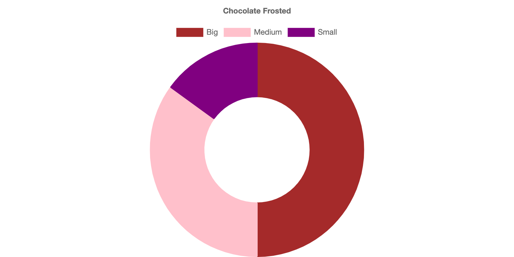
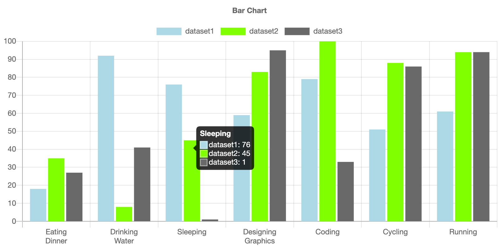
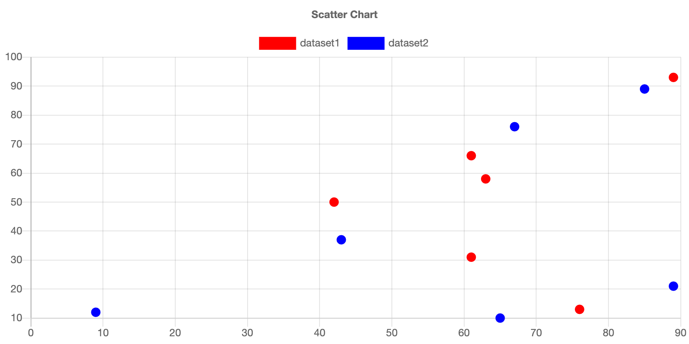
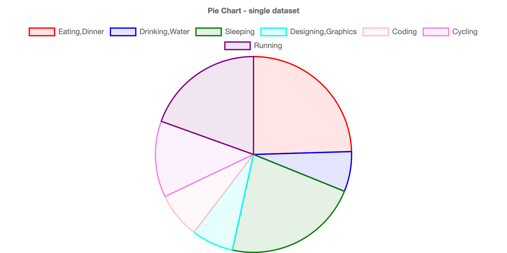
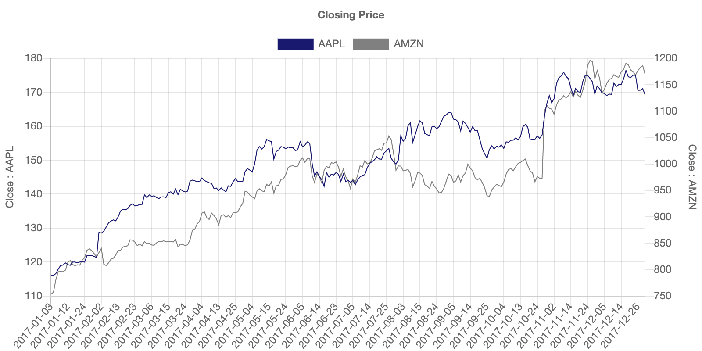
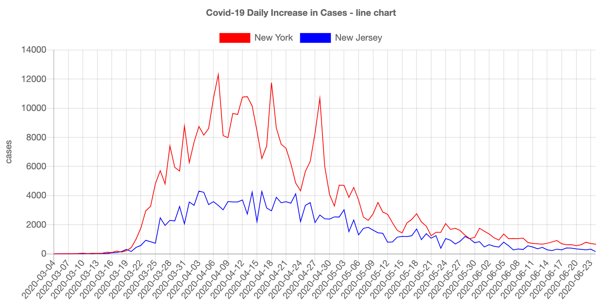

[](https://mybinder.org/v2/gh/AaronWatters/Chart_ipynb.git/master)

# Chart_ipynb

Simple jupyter widget wrappers for 
<a href="https://www.chartjs.org/">
Chart.js chart types.
</a>

```python
doughnut_chart = doughnut.Doughnut()
doughnut_chart.set_title("Chocolate Frosted")
doughnut_chart.add("Big:, 10, "brown")
doughnut_chart.add("Medium", 7, "pink")
doughnut_chart.add("Small", 3, "purple")
doughnut_chart.setup()
doughnut_chart
```
<p align="center">
                    
</p>


## Development install

```
pip install -e .
```

## Baisc Charts 

`Chart_ipynb` makes it easier to present data interactively on Jupyter. Some basic charts are introduced in [quick reference](https://github.com/AaronWatters/Chart_ipynb/blob/master/notebooks/chart_ipynb%20quick%20reference.ipynb).  

| Charts |  |
|:--------:|:---:|
| Line Chart||
| Bar Chart| |
| Scatter Chart| |
| Pie Chart| |
|...||


## Time Series

`Chart_ipynb` provides an additional function to initialize line chart and bar chart specifically for time series data. Users can either use their own data as input or use inner data by specifying ticker symbol of company to obtain the data from data websites (`quandl` by default).  
The example can be found [here](https://github.com/AaronWatters/Chart_ipynb/blob/master/notebooks/time%20series%20example.ipynb). 
<p align="center">

</p>

## Covid-19 Examples

The [example](https://github.com/AaronWatters/Chart_ipynb/blob/master/notebooks/Covid19%20Examples.ipynb) presents the tendency of Covid-19 cases and deaths based on states.   
<p align="center">

</p>
