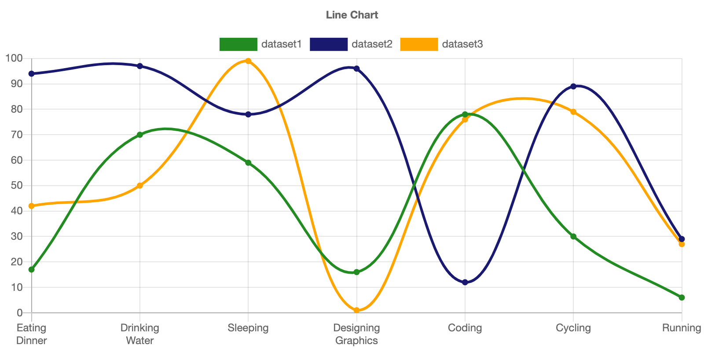

[](https://mybinder.org/v2/gh/AaronWatters/Chart_ipynb.git/master)

# Chart_ipynb

Simple jupyter widget wrappers for 
<a href="https://www.chartjs.org/">
Chart.js chart types.
</a>


## Development install

```
pip install -e .
```

## Examples 

`Chart_ipynb` makes it easier to present data interactively on Jupyter. Some basic charts are introduced in [quick reference](https://github.com/AaronWatters/Chart_ipynb/blob/master/notebooks/chart_ipynb%20quick%20reference.ipynb).  

| Charts |  |
|:--------:|:---:|
| Line Chart||
